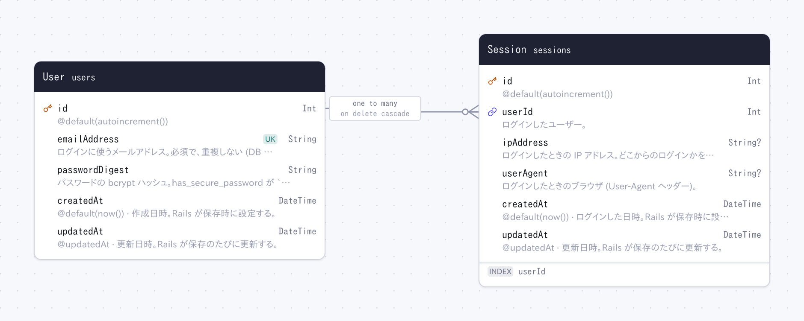

# rails-auth-minimal

Rails 8.1 で作った最小限の認証 (アカウント登録・ログイン・ログアウト) のアプリ。ローカルで動かして学ぶための学習用です。

- 認証: Rails 標準の `bin/rails generate authentication` が作る形をそのまま使う (`has_secure_password`、Session テーブル、署名付き Cookie)。gem は `bcrypt` だけ
- DB: SQLite。スキーマは `prisma/schema.prisma` で管理し、[hekireki](https://github.com/nakita628/hekireki) がモデル・バリデーション・その翻訳・ER 図を生成する
- 画面: 素の HTML フォームと Tailwind CSS。JavaScript (Hotwire) は使わない
- 言語: 日本語 (既定) と英語。URL の先頭で切り替わる (`/` と `/ja` は日本語、`/en` は英語)



## 必要なもの

- Ruby 4.0.7 (`mise install`)
- Node.js と pnpm (Prisma と hekireki 用)

## 使い方

```bash
bin/setup      # 依存のインストール、モデル生成、DB 作成、サーバー起動
bin/dev        # サーバー起動 → http://localhost:3000
bin/rails test # テスト
bin/rubocop    # コードスタイルのチェック (rubocop-rails-omakase)
bin/docs       # ドキュメント (YARD) → http://localhost:8808
```

最初は `http://localhost:3000/registration/new` でアカウントを作る。

## 認証の仕組み

| URL | コントローラ | すること |
| --- | --- | --- |
| `GET /registration/new`, `POST /registration` | `RegistrationsController` | ユーザーを作り、そのままログインする |
| `GET /session/new`, `POST /session` | `SessionsController` | `User.authenticate_by` で照合し、ログインする |
| `DELETE /session` | `SessionsController` | ログアウトする |
| `GET /` | `HomeController` | ログインが必要なページの例。ログイン履歴 (Session) を表示する |

1. ログインすると `Session` の行を 1 件作り、その ID を署名付き Cookie `session_id` に入れる (`Authentication#start_new_session_for`)
2. 以後のリクエストは Cookie の ID で `Session` を探し、`Current.session` / `Current.user` に入れる (`Authentication#resume_session`)
3. `ApplicationController` の `before_action :require_authentication` が、未ログインならログイン画面へ送る。ログインなしで見せるアクションは `allow_unauthenticated_access` で外す
4. ログアウトは `Session` の行と Cookie を消す (`Authentication#terminate_session`)。行が消えれば、その Cookie は使えない

パスワードは `has_secure_password` が bcrypt でハッシュ化して `password_digest` に入れる。ログインは 3 分間に 10 回まで (`rate_limit`)。

`bin/rails generate authentication` との違い:

- アカウント登録の画面 (`RegistrationsController`) を足している。ジェネレータはユーザーの作り方を決めない
- パスワードの再設定 (`PasswordsController`、`PasswordsMailer`) は入れていない。メール送信の設定が必要になるため
- モデルはジェネレータのマイグレーションではなく `prisma/schema.prisma` から生成する (テーブルの形は同じ)

## スキーマの変更

`prisma/schema.prisma` を編集して、次を実行する。

```bash
pnpm db:push   # DB に反映し、モデルと ER 図を作り直す
```

Rails のマイグレーション (`bin/rails db:migrate` など) は使わない。

## 生成物

`prisma/schema.prisma` から hekireki が生成する。git で管理するので、スキーマを変えたときは生成物の差分もいっしょにコミットする。手では編集しない。

| ファイル | 作るもの |
| --- | --- |
| `app/models/` (`current.rb` を除く) | hekireki |
| `config/locales/models/` | hekireki |
| `er.png` | hekireki |

`app/models/current.rb` (`Current`) はテーブルを持たないので、手で書いている (`bin/rails generate authentication` が作るものと同じ)。

次は git 管理外。

| ファイル | 作るもの |
| --- | --- |
| `app/assets/builds/tailwind.css` | Tailwind |
| `doc/` | YARD (`bundle exec yard doc`) |
